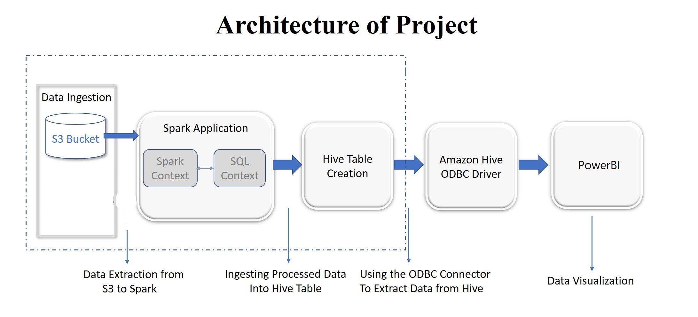

# ***Covid19 Analysis on AWS EMR***

# Description

Using AWS's popular cloud services, such as EMR and S3. I attempted to apply my theoretical understanding by setting-up an EMR cluster on Cloud that included major distributed computing frameworks such as Apache Spark, Hive, and Hadoop. To visualise the publicly accessible OWID dataset using a popular visualisation tool such as PowerBI.


# Screenshot





# Technologies and Frameworks Used

- Cloud Computing
- Hadoop
- Hive
- Pyspark

# Setup

## Downloading the Dataset 

- Clone the Our World in Data [githhub repo](https://github.com/owid/covid-19-data/tree/master/public/data)


## Data Ingestion on S3
- Setup an S3 Bucket and Dump the dataset
- Change the access to public


## EMR cluster on AWS using Spark, Hadoop And Hive 

- Navigate to AWS Master Console and Setup EMR Cluster with the desired Configuration
- Enable SSH port access under Security Group
- Establish a connection to EMR Cluste using SSH on your local machine 	
```ssh -i cowid.pem <hadoop cluster ip> ```
- Copy the spark code files from local to cloud using scp command.
- Create an empty hadoop directory on cloud cluster
```
hadoop fs -mkdir <dir name>
```
- Finally dump the dataset from S3 to the newly created hadoop directory
```
hadoop fs -cp s3//directory <dir name>
```

## Executing pyspark code

- Execute Pyspark code 
``` 
spark-submit code.py
```
- This will create a parquet file (binary format) and dump that file on S3

- Execute main.py (To load parquet file and make table on hive)

```
spark-submit --conf spark.sql.catalogImplementation=hive main.py
```
- Tables will get created on hive default database

## Connecting PowerBI to hive (Local Machine Setup)

- Download the latest Amazons Hive ODBC driver from [here](http://awssupportdatasvcs.com/bootstrap-actions/Simba/latest/)
- Navigate to ODBC datasource on Windows 
- Under System_dsn tab click on add new connection
- select hive odbc driver and fill-in the details 
- Data source name and under host mention the IP address of EC2 master's machine
- Enter hadoop as the user name in authentication


## Launch PowerBI
- Fetch the data (Select ODBC soource)
- Load all hive tables on BI
- Create dashboard


